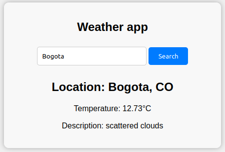
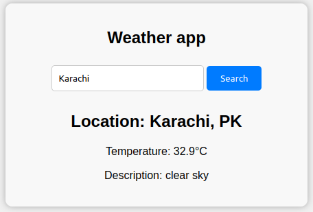

# weather
Weather app made with HTML, CSS and JS and Open Weather API. You simply have to type the name of the city that you'd like to know the weather, then the app returns the current temperature, and current weather

